# Pictionary

## Pictionary Lab

In this lab we will be tackling a new concept within Scratch, using the pen tool. We will also be using more stages rather than sprites. To start, let's do problem decomposition.
 - Create logo
 - Create cursor
 - Create buttons
 - Make stages to start and instruct players
 - Add game logic
 - Add level stages and logic

###Create Logo

  This logo will be a sprite. Use blocks to create borders and use the text tool to create the Pictionary name.
  
  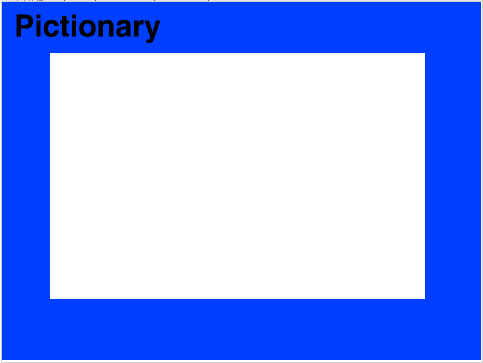
  
###Create Cursor

  Create a circle sprite and shrink it to about the size of a cursor. 
  
  Now let's create the logic for it. 
  
  First, when the flag is clicked we want to clear all the pen. Then create a forever loop which we will place all of the pen commands in. 
  
  Set the pen color and size, then have it point towards the mouse pointer. We also want it to move naturally in the path that the mouse pointer moved, so we can select the motion "move () steps" with the division operator in it. Within this place "distance to mouse-pointer" divided by about 3.5, or whatever you see fit.
  
  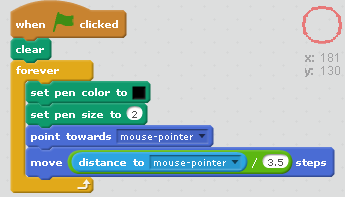
  
  Now, we can start actually writing. Insert an if-else statement into the forever loop to sense for when the mouse is down. If its true have the pen down and else have pen up. 
  
  We also don't want the pen to write beyond the borders, insert four if statements to sense each of the four borders. Using greater than and less than operators, sense if x and y positions are past the positions they should be at and choose set x or y to that position as well as pen up. This will stop it from writing on the edges.
  
  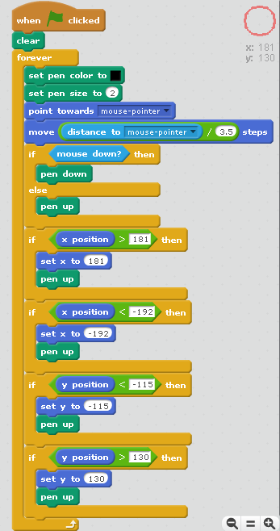
  
###Create Buttons

  First, lets create the clear button. 
  
  Create a sprite that looks like a clear button. 
  
  
  
  Drag it to the top right corner, or where you would like it to appear during the game. Add logic for "when this sprite clicked" to "clear" all of the previous pen.
  
  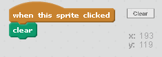
  
  Now, create a sprite that looks like a guess button.
  
  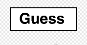
  
  Drag it next to the clear button, and create logic for "when this sprite clicked" and "broadcast 'Guess"".
  
  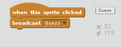
  
  At this point we also have to create a variable called Answer. We are going to initialize this variable as zero later, we will use this to tell the buttons when to appear.
  
  Under one of the button's scripts select "when flag clicked" and "hide". Since the game will create an answer once the player is ready to draw, we want these buttons to hide until then. Therefore, we can add "wait until" and use the "not" and "equal" operators to state when the answer is not 0. Then "show" the sprite. Copy this piece of code for both buttons.
  
  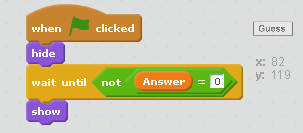
  
###Make Stages

  First, let's make a start backdrop named "Start". Instruct the player on how to play the game, it should look something like this. **Note:** Remind the player to enter the answer in all caps so it does not tell them their answer is wrong for that reason.
  
  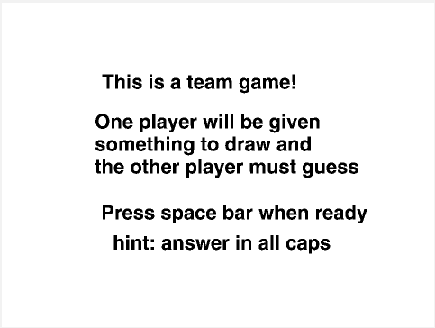
  
  Now, make a stage that indicates that Player 1 will be drawing and Player 2 will be guessing and call it "Player 1". Do the opposite and call it "Player 2".
  
  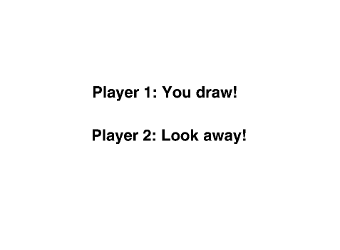
  
  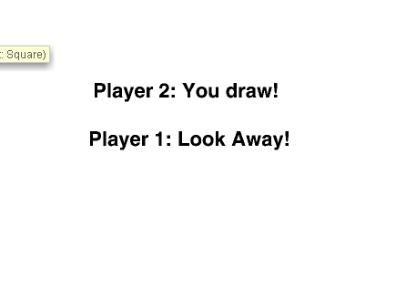
  
  Now, create a blank stage called "Draw".
  
  Lastly, create a stage with only the word of the first object you want the player to draw. I chose "BASEBALL". Call this stage "Level One".
  
  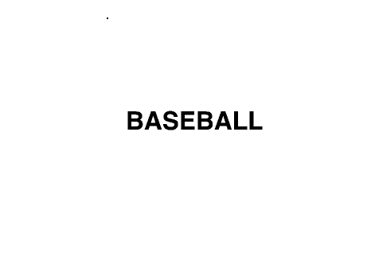
  
###Add Game Logic

  There will be a few parts to this.

  1. First, we need to create and initialize all our variables. Create a "Player 1", "Player 2", and "Score" variable. 
  
    Now, "when flag clicked" write logic to "switch backdrop to 'Start'" and initialize all three of these variables as well as "Answer" from before as zero.
  
    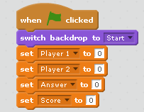
  
   Since we told the players to press space key when ready, select the "when 'space' key pressed" for the next string and "switch backdrop to 'Player 1'". This is where our "Player 1" and "Player 2" variables come in, to tell our game which player is drawing and which is guessing. At this point "set 'Player 1' to 1" and "set 'Player 2' to 0".
  
    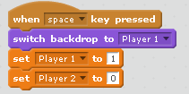
  
    Next, "wait 3 secs" and "switch the backdrop to 'Level One'". Add "wait 1 secs" and then "set 'Answer' to 'BASEBALL'" (or whatever you chose), which will cause the buttons to appear. At the same time you want to "switch backdrop to 'Draw'".
  
    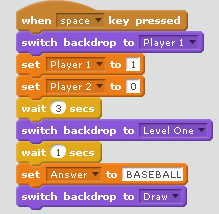
  
  2. The second part of the logic is to let the player guess.
  
    Select "when I recieve 'Guess'", we already broadcasted this message when the 'Guess' button was pressed. Now select "ask () and wait" from sensing and in this blank delete the initial text. 

    Create and if-else loop to sense if the answer entered is equal to the variable 'Answer'. If it is "broadcast 'Win'" and "change 'Score' by 1" and if not "broadcast 'Lose'".
    
    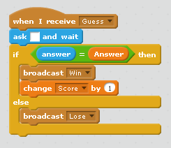
    
  3. For the third part we will need to create two more stages. One for when the players win and one for when the players lose. Call them "Win" and "Lose".
  
    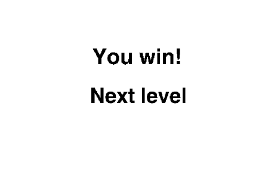

    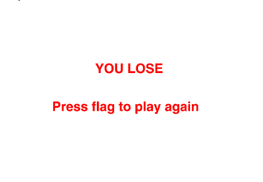
    
    Create the logic for winning using "when I recieve 'Win'" and "clear" all the pen and then "switch backdrop to 'Win'".
    
    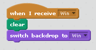
    
    Create the logic for losing using "when I recieve 'Lose'" and "clear" all the pen. Then, "switch backdrop to 'Lose'" and "stop all".
    
    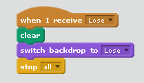

###Add Levels

  To add levels, we need to know whether to make Player 1 or Player 2 guess.
  
  Adding to the winning logic, "wait 2 secs" and add an if-else statement to sense if the variable "Player 1" is equal to 1.
  
  If it is "set 'Player 2' to 1" and "set 'Player 1' to 0", this will reset it for the next round. Then "switch the backdrop to 'Player 2'", "wait 2 secs" and "broadcast 'Next Level'". 
  
  You can copy the same logic for the else portion and just switch "Player 1" and "Player 2".
  
  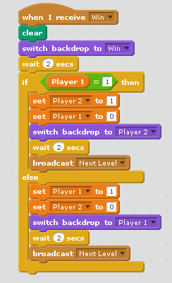
  
  Now create a new stage with the word for want to display for the next level and call it "Level Two". I chose LION as my word.
  
  
  
  To make our next level logic, start with "when I recieve 'Next Level'. Add an if statement to sense if the "Score" is equal to 1, which it should be if they won the first level. Then, "set 'Answer' to LION" (or whatever you chose) and "switch backdrop to 'Level Two'". Lastly, "wait 2 secs" and "switch backdrop to 'Draw"".
  
  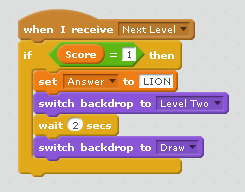
  
  To add more levels, simply repeat these steps by creating a stage with the word and and if statement with the correct score. Don't forget to change the answer and backdrop to the ones that fit. 
  
###What's Next
 - Add a timer 
 - Create more levels
 - Add colors for pens
